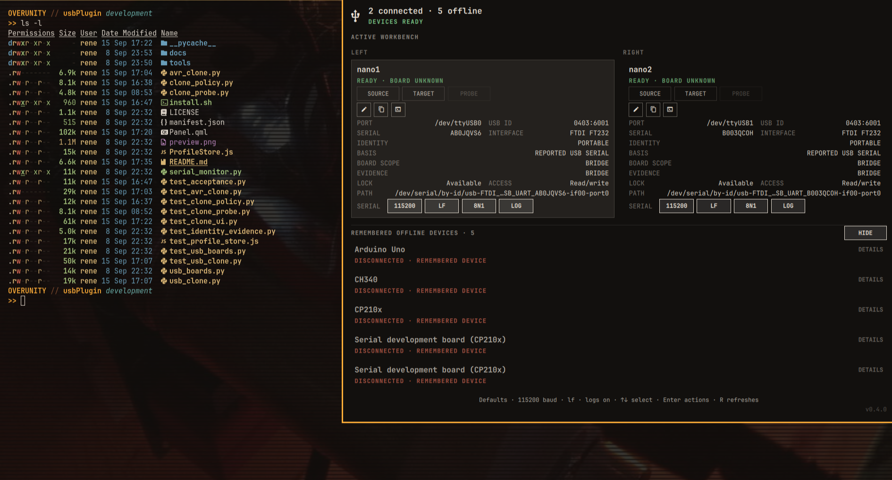

# USB Boards for Omarchy

An Omarchy bar plugin for USB development boards, USB functions, bootloaders,
and serial adapters. It uses Linux sysfs and the Python standard library. It
does not require third-party Python packages or a background service.



## Features

- detects serial devices plus DFU, UF2/bootloader, CMSIS-DAP, and JTAG modes
- reports board-identification confidence, evidence, and scope
- recognizes CH34x/CH91xx, CP210x, FTDI, and PL2303 serial bridges
- groups multiple serial interfaces that belong to one physical USB device
- reports portable or port-bound profile identity without using `/dev` paths as
  proof of physical identity
- remembers device names and monitor profiles while devices are disconnected
- includes a reconnecting serial monitor with selectable format and line ending
- supports timestamped RX/TX session logs with private file permissions
- provides guarded clone workflows for validated ESP32 and AVR serial profiles

## Install

Install and enable the plugin from its Git repository:

```bash
omarchy plugin add https://github.com/ariDev1/usbPlugin --enable
```

To place the enabled widget in the right bar section:

```bash
omarchy bar move dev.usb-boards --section right
```

For local development, `install.sh` copies the current checkout into the Omarchy
plugin directory and adds it to the bar:

```bash
./install.sh
```

## Usage

Select a connected device from the bar. The panel can copy its serial
connection path, assign a friendly name, or open the serial monitor. Press
`Ctrl+]` to close the monitor.

Set global serial defaults with:

```bash
omarchy bar set dev.usb-boards baudRate 9600
omarchy bar set dev.usb-boards lineEnding crlf
omarchy bar set dev.usb-boards sessionLogging true
```

Line endings are `none`, `lf`, `cr`, or `crlf`. Supported serial formats are
`8N1`, `8N2`, `7E1`, and `7O1`. Per-device controls override the global
defaults.

If a port is inaccessible, **Grant access** opens a terminal, explains the
persistent group-membership change, and asks for confirmation before running
`sudo usermod`. Log out and back in once after granting access.

## USB Identity

USB Boards separates detection, physical identity, and the current connection
path.

A reported USB serial can provide portable identity. A known default serial or
a missing serial uses USB topology and is port-bound.

Generic FTDI, CP210x, CH34x, CH91xx, and PL2303 bridges identify the USB bridge
only. USB Boards does not infer which development board is behind a generic
bridge.

Linux paths such as `/dev/ttyUSB0`, `/dev/ttyACM0`, and
`/dev/serial/by-id/...` are connection information. They are not proof of
physical identity.

See [USB Identity Model](docs/USB_IDENTITY_MODEL.md) for the detailed evidence
and profile migration rules.

## Detection Scope

USB evidence can identify a board, family, function, bootloader, bridge, or an
unknown device. The plugin exposes that scope instead of presenting every
detection result as an exact board identity.

| Device class | Evidence recognized |
| --- | --- |
| Arduino | Known USB IDs, vendor evidence, and product descriptors |
| Espressif | Native USB JTAG/serial IDs, vendor evidence, and descriptors |
| Raspberry Pi RP-series | Serial functions and RP2/UF2 bootloader |
| STM32 | Virtual COM and DFU bootloader |
| PJRC Teensy | Serial function and HalfKay bootloader |
| BBC micro:bit / Arm mbed | DAPLink and CMSIS-DAP |
| Adafruit / Seeed | Vendor and product descriptor evidence |
| Generic serial bridges | CH34x/CH91xx, CP210x, FTDI, and PL2303 bridge only |

A generic serial bridge does not prove which development board is behind it.

## Guarded Clone

Clone operations use active hardware evidence. They do not change the passive
USB board-identification result.

The current validated clone families are:

- `esp32-classic-spi-flash`: full raw SPI flash clone for validated profiles
- `avr-stk500v1-serial`: 32 KiB serial flash access through STK500v1

The AVR path writes only the application region `0x0000-0x7dff`. It preserves
and validates the bootloader region `0x7e00-0x7fff`. It does not clone EEPROM,
fuses, lock bits, calibration data, or factory identity.

Target writes use explicit SOURCE and TARGET identities, two-step operator
confirmation, connection-continuity checks, and independent readback
verification.

See [USB Identity Model](docs/USB_IDENTITY_MODEL.md) for the evidence and
verification boundaries.

## Serial Monitor and Session Logging

Session logging is enabled by default. Disable it globally with:

```bash
omarchy bar set dev.usb-boards sessionLogging false
```

Logs are stored under
`${XDG_STATE_HOME:-~/.local/state}/omarchy/usb-boards/sessions/`. The sessions
directory is owner-only (`0700`) and new log files are owner-only (`0600`).

Session logs contain the complete RX/TX serial traffic. Treat them as
potentially sensitive device data.

## Troubleshooting

Run the scanner directly to separate USB discovery from panel rendering:

```bash
python3 usb_boards.py --pretty
```

If nothing appears there, Linux has not exposed a supported USB device. Try a
known data-capable cable and another USB port. A charging-only cable can power a
board without making it discoverable.

Force Omarchy to rediscover plugin files with:

```bash
omarchy-shell shell rescanPlugins
```

## Development and Acceptance

Run the source-level checks from the repository root:

```bash
node test_profile_store.js
python3 -m unittest -v
python3 -m py_compile usb_boards.py serial_monitor.py clone_probe.py clone_policy.py usb_clone.py avr_clone.py tools/usb_boards_acceptance.py test_usb_boards.py test_acceptance.py test_identity_evidence.py test_clone_probe.py test_clone_policy.py test_usb_clone.py test_clone_ui.py test_avr_clone.py
bash -n install.sh
omarchy plugin validate .
```

On an Omarchy workstation, run the deterministic runtime acceptance gate:

```bash
python3 tools/usb_boards_acceptance.py
```

The runtime gate requires the `development` branch. The active Omarchy plugin
must be a real directory copy, not a symlink. Each defined runtime file must
match the development checkout byte-for-byte. The gate validates the plugin,
restarts the Omarchy shell, reads runtime state, and compares scanner and
runtime identity evidence.

When adding a new exact VID/PID board entry, add a regression case to the board
identification tests.

## Remove

Remove the plugin with Omarchy:

```bash
omarchy plugin remove dev.usb-boards
```

Session logs are kept intentionally. To delete the stored RX/TX logs as well:

```bash
rm -rf "${XDG_STATE_HOME:-$HOME/.local/state}/omarchy/usb-boards"
```

## License

MIT. See [LICENSE](LICENSE).
